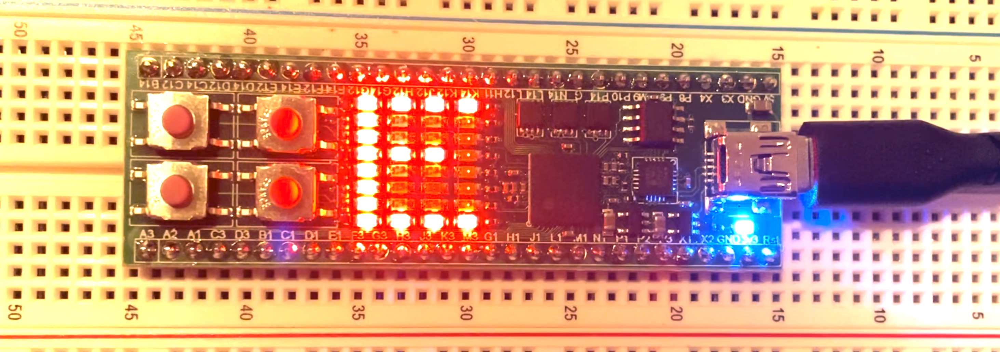

# rg-iceFUN
FPGA code examples for the iceFUN board. The example here is a scrolling 'HELLO WORLD!' display.  



## Pre-requisites

You need open source FPGA development tools like *yosys*, *nextpnr-ice40*, *icepack* and *iceFUNprog*. I pretty much work on MacOS and these tools work great there but will also install on a Windows or Linux machine. 

https://github.com/YosysHQ/oss-cad-suite-build

## Install & Build

Install Code
```
git clone git@github.com:robin7g/rg-iceFUN.git
cd rg-iceFUN
cd scrolltext
```
Make and then install on your iceFUN
```
make
make burn
```


